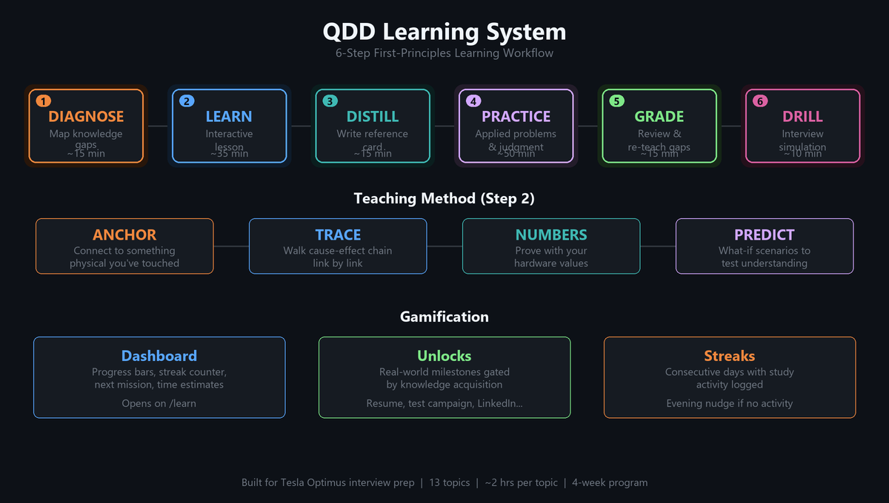

# QDD Gearbox

A quasi-direct-drive actuator built around a D6374-150KV BLDC motor, 5:1 3D-printed planetary gearbox, and ODrive v3.6 controller. Designed for backdrivability and impedance control.



## What this is

I'm designing a QDD actuator as a hands-on vehicle for learning actuator design, controls, and testing methodology. The project covers the full stack: mechanical design in CATIA, Python calculators for gear geometry and thermal analysis, a structured test campaign, and a conversational learning system that ties it all together.

The gearbox is 3D printed in PLA on a consumer FDM printer. Total budget is under $120 CAD. It's not trying to compete with commercial actuators; it's trying to teach me how they work from the physics up.

## Project structure

```
calc/           Python design calculators (gear geometry, tooth stress, bearing life, thermal)
docs/           Design docs, specs, original trade studies
  specs/        Design specs and implementation plans
  design/       Tolerances, assembly profile, gear parameters
  catia/        CATIA workflows and skeleton modeling guide
drawings/       GD&T annotation notes
prototypes/     Organized by revision (rev00a, rev00b)
testing/        Test campaign, test bench design, learning system
  learn/        Learning system v2 (workbooks, progress tracking, reference cards)
src/            Future firmware and ODrive config
ui/             Tkinter dashboard for calc results
```

## The learning system

The test campaign needs me to actually understand motor physics, not just run procedures. So I built a learning system around that.

It's a Claude Code skill (`/learn`) that runs a 6-step workflow per topic:

1. **Diagnose** - Concept-check questions to map where the gaps are
2. **Learn** - Interactive lesson targeting those gaps. Traces cause-effect chains using my actual hardware values, not abstract theory.
3. **Distill** - I explain back what I learned. Claude writes it into a reference card in my words.
4. **Practice** - Applied problems and design judgment questions from the workbook, graded immediately
5. **Grade** - Summary of performance, live probing on weak spots
6. **Drill** - Tesla interview simulation. Rapid-fire first-principles questions until I break, then teach the gap.

13 topics covering motor fundamentals through FEA literacy. Everything happens in one conversation; no switching between editors and terminals.

### Gamification

Progress tracked in `testing/learn/progress.json`. Streak counter, visual dashboard, and real-world unlocks gated by actual knowledge:

| Topics completed | What it unlocks |
|-----------------|----------------|
| 01-02 | Update resume with motor characterization |
| 01-05 | Start the test campaign |
| 01-07 | LinkedIn post about testing methodology |
| 01-09 | Message Tesla contacts about impedance control |
| All 13 | Interview-ready |

Evening nudge notification via Windows Task Scheduler if no study activity logged that day.

### Teaching method

The lesson step (step 2) follows a specific chain:

**Anchor** - Connect each concept to something physical I've touched. My motor, my gearbox, my ODrive.

**Trace** - Walk the mechanism link by link. "Current flows through stator windings. What does that create?" I answer, Claude confirms or corrects, we move to the next link.

**Numbers** - Plug in my actual hardware values. $K_t = 0.0551$ Nm/A, 5:1 ratio, 90% efficiency. Real answers I can sanity-check against what I've measured.

**Predict** - "What if we used a 300KV motor instead?" I reason through it before getting the answer. Wrong predictions reveal where the mental model breaks.

### Running it

```
# In Claude Code, from the qdd-gearbox directory
/learn
```

Shows a dashboard with progress, streak, and next mission. Type "let's go" to start.

## Hardware

| Component | Spec |
|-----------|------|
| Motor | D6374-150KV ($K_t = 0.0551$ Nm/A, 7 pole pairs) |
| Controller | ODrive v3.6 (8 kHz FOC) |
| Gearbox | 5:1 planetary, 3D printed PLA |
| Supply | 24V nominal |
| Encoder | Magnetic (integrated with ODrive) |

## Status

Rev 00B printed and assembled. Learning system built and ready to use. Test campaign starts after topics 01-05 are complete.

## License

This is a personal learning project. Not intended for redistribution.
