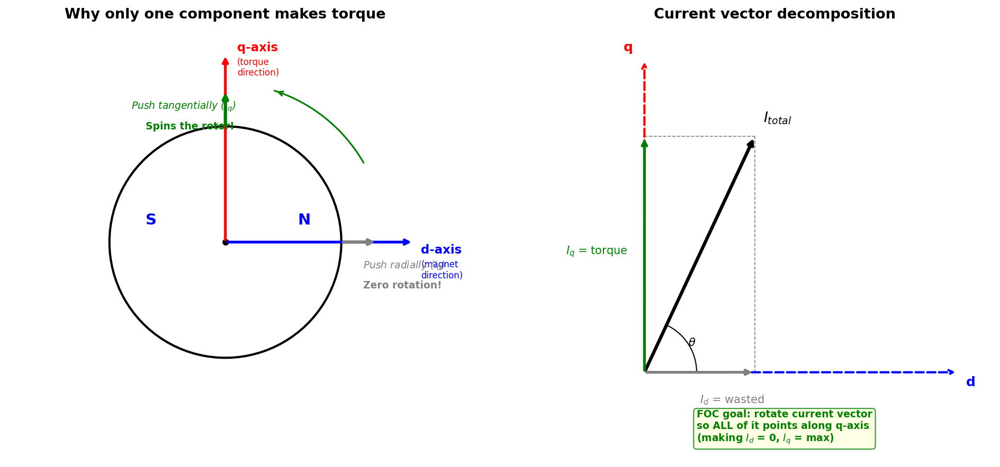
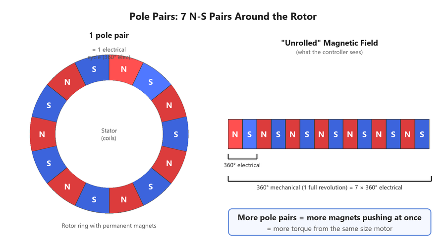
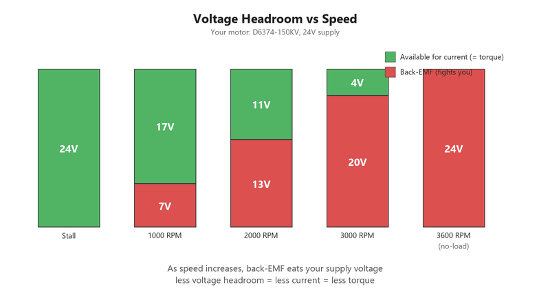
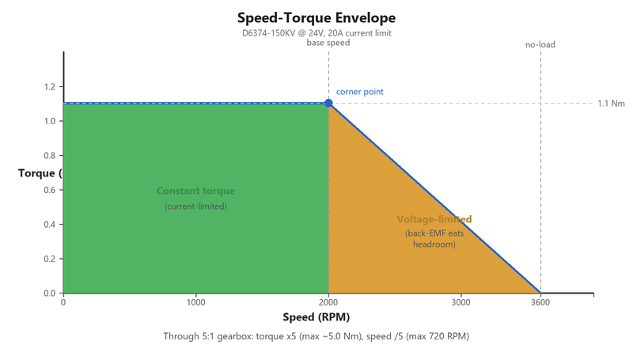

# Lesson: Motor Fundamentals + Torque-Speed Envelope

> Topics 01 & 02 — paired session
> Targeting your diagnosed gaps. Read in Obsidian for rendered equations.
> Your hardware: D6374-150KV, 7 pole pairs, ODrive v3.6, 5:1 planetary, 24V supply

---

## 1. Lorentz Force — How Your Motor Makes Torque

A wire Just for memorization. And the order of these questions, I'm assuming it's KV. because K V is wait, K V is RPMs divided by voltage. Oh, so I guess you multiply that by volts of the RPM. Or What was it? KV is proportional to K T the torque producing current. I guess. Oh I think I'm rusty on this.carrying current $I$, sitting inside a magnetic field $B$, feels a force:

$$F = B \cdot I \cdot L$$

- $B$ = magnetic field strength (from permanent magnets on your rotor — **fixed**)
- $L$ = length of wire in the field (set by stator winding geometry — **fixed**)
- $I$ = current through the wire (**the only thing you can control**)

Since $B$ and $L$ are baked into the hardware, force is **directly proportional to current**. Double the current, double the force. This linearity is the foundation of everything that follows.

That force acts on a wire at some radius $r$ from the shaft center, so it creates torque:

$$\tau = F \cdot r = B \cdot I \cdot L \cdot r$$

Group the fixed hardware constants ($B$, $L$, $r$, number of turns, winding arrangement) into one number, and you get:

$$\tau = K_t \cdot I$$

But there's a catch: not all of the current flowing through the motor produces torque. The Lorentz force is maximized when the current is perpendicular (90°) to the magnetic field — that's the geometry where force = $B \cdot I \cdot L$ in full. If the current is parallel to the field, it produces zero force. In general, only the perpendicular component contributes.

**But wait — current flows through wires. How can it have a "direction"?**

Your stator has 3 sets of coils (phases A, B, C), arranged physically around the circle at 120° from each other. Each coil, when energized, creates a magnetic field pointing in its own direction. By choosing how much current to push through each of the 3 coils simultaneously, the combined magnetic field can point in **any direction** around the circle.

Think of it like 3 ropes tied to a ring, attached at 120° apart. By pulling different amounts on each rope, you can pull the ring in any direction you want. The "direction" of your pull is the **current vector** — it's not the direction current flows through a wire, it's the direction of the **net magnetic field** the stator produces.

Now, that current vector can point in any direction relative to the rotor's magnets. Decompose it into two components:

- **$I_q$ (quadrature)** — the component **perpendicular** to the rotor's magnetic field (the N-S axis). This is the part that creates torque, like pushing tangentially on a merry-go-round. All your force goes into rotation.
- **$I_d$ (direct)** — the component **parallel** to the rotor's magnetic field. This creates force (radial pull/push on the rotor magnets), but that force has no moment arm around the shaft — like pushing radially on a merry-go-round. Real force, zero rotation. Just loads the bearings and heats the windings.



**Why can the controller choose where to point the current vector?** Because it has 3 independent knobs (the current in each phase), and it knows exactly where the rotor's magnets are at every instant (from the encoder). So it:
1. Reads encoder → knows where the d-axis (magnet direction) and q-axis (90° ahead) are right now
2. Calculates what combination of phase A, B, C currents will make the net field point along the q-axis
3. Drives those currents
4. Result: $I_d = 0$, all current is $I_q$, maximum torque per amp

So the torque equation is:

$$\tau = K_t \cdot I_q$$

Only $I_q$ counts. $I_d$ is wasted energy. The controller's job (FOC, covered in Section 3) is to keep $I_d = 0$ so that all your current goes into making torque.

$K_t$ is the torque constant — it packages all the fixed geometry and magnetics into one number. For your D6374: $K_t = 0.0551$ Nm/A. Every amp of $I_q$ produces 55.1 mNm of torque.

**Why is this linear?** Because the Lorentz force is linear in current. There's no squaring, no threshold, no saturation (in the ideal model). 1A → 0.0551 Nm. 10A → 0.551 Nm. Straight line through the origin.

---

## 2. Pole Pairs and Electrical Angle

### Why pole pairs exist

A motor with a single north-south magnet pair would have only one spot around the circle where the stator coils can push on it. More magnet pairs = more spots pushing simultaneously = more torque from the same size motor. Your D6374 has **7 pole pairs** — 7 north-south pairs arranged around the rotor ring. That means 7 spots are contributing torque at every instant.



### What the controller sees

Each N-S pair creates one complete magnetic cycle. As the rotor turns, the controller encounters N-S-N-S-N-S... repeating 7 times before one full mechanical revolution is complete.

The controller doesn't care about mechanical position — it cares about where it is **within the current N-S cycle**, because that determines how to aim the current for maximum torque (the 90° push from Section 1). One N-S cycle = 360° **electrical**.

So:
- 1 mechanical revolution = 7 electrical cycles = 2520° electrical
- **Electrical angle** = 7 × mechanical angle

### Why this matters practically

The encoder reads mechanical position. The ODrive firmware multiplies by 7 to get electrical position. If the pole pair count is set wrong in the ODrive config (say 6 instead of 7), the controller calculates the wrong electrical angle, aims the current at the wrong spot in the N-S cycle, and the motor shakes instead of spinning smoothly. This is one of the first things to verify when commissioning a motor.

---

## 3. FOC — What the Controller Actually Does

There are three common ways to drive a BLDC motor, each adding more intelligence:

1. **Trapezoidal (six-step)** — Only 2 of 3 coils powered at a time. Hard-switches every 60°. Cheap and simple, but the torque lurches between steps. Good enough for fans and cheap drones.

2. **Sinusoidal** — All 3 coils powered with smooth sine waves (120° offset). Eliminates torque ripple. But it's **open-loop on current direction** — it plays sine waves at the right timing and hopes the current follows perfectly.

3. **FOC (Field-Oriented Control)** — Sinusoidal + **closed-loop correction**. It measures the actual current, checks how much is $I_q$ (useful) vs $I_d$ (wasted), and actively corrects to keep $I_d = 0$. If load or speed causes the current to drift from the ideal 90° angle, FOC catches it and adjusts. It does this 8,000 times per second on your ODrive.

**Why FOC over sinusoidal?** At low speed with light load, they're nearly identical. The difference shows up under heavy load (current lags due to inductance), fast transients, or high speeds — conditions where the actual current drifts from the commanded sine waves. FOC notices and corrects; sinusoidal doesn't.

**Your ODrive uses FOC.** When you command a torque, it:
1. Reads encoder → calculates electrical angle (× 7 pole pairs)
2. Measures actual phase currents → decomposes into $I_q$ and $I_d$
3. Adjusts the phase drives to push $I_d$ to zero and $I_q$ to your commanded value
4. Repeats 8,000 times per second

---

## 4. Phase Current vs. $I_q$

Your motor has 3 wires (A, B, C), each feeding one set of coils. **Phase current** is simply the current flowing through one of those wires.

Each wire's current isn't steady — it's a sine wave that swings positive and negative as the coils take turns. At any instant, the three wires carry different amounts of current. This is the raw reality of what's flowing through the hardware.

**$I_q$** is what the controller computes by looking at all three phase currents together and asking: "what's the net torque-producing effort?" It combines the messy oscillating values into one clean, steady number that directly equals torque.

**What you need to remember:**
- **Phase current** = what one individual wire is doing (oscillating AC)
- **$I_q$** = the combined useful output of all three wires (steady DC value)
- When the ODrive reports $I_q = 3.2$ A → torque = $0.0551 \times 3.2 = 0.176$ Nm
- You interact with $I_q$. The per-phase currents are an implementation detail.

> **Note:** Phase current also matters for thermal calculations (Topic 03) — the heating in the windings depends on the RMS (effective) value of the oscillating current. See the [electrical intuition primer](00-electrical-intuition-primer.md) if RMS or other electrical terms are unfamiliar.

---

## 5. The $K_t$ / $K_e$ / $K_v$ Triangle

These three constants describe the same motor and are locked together by physics — if you know any one, you know all three.

**$K_v$ (velocity constant):** 150 RPM/V for your D6374. This means: with no load and 1V of back-EMF, the motor spins at 150 RPM. It's how fast the motor spins per volt.

**$K_e$ (back-EMF constant):** The voltage the motor generates per unit of speed. This is the **same physical phenomenon** as $K_t$, just observed from the other direction:
- $K_t$: current in → torque out (motor mode)
- $K_e$: speed in → voltage out (generator mode)

Both come from the same interaction between conductors and magnets. When a wire moves through a magnetic field, it experiences a force (Lorentz → torque). When a wire moves through a magnetic field, it also generates a voltage (Faraday → back-EMF). Same wire, same field, two manifestations.

**The conversions:**

$$K_e = \frac{1}{K_v} \quad \text{(when Kv is in rad/s per volt)}$$

$$K_t = K_e \quad \text{(in SI units: Nm/A = V·s/rad)}$$

For your motor:
- $K_v = 150$ RPM/V $= 150 \times \frac{2\pi}{60} = 15.71$ rad/s per volt
- $K_e = \frac{1}{15.71} = 0.0637$ V·s/rad (line-to-line)
- $K_t = \frac{60}{2\pi \cdot K_v} \cdot \frac{1}{\sqrt{3}} \approx 0.0551$ Nm/A (phase, after √3 correction for 3-phase)

The $\sqrt{3}$ factor appears because $K_v$ is typically specified line-to-line, but torque production happens per-phase. The exact conversion is:

$$K_t = \frac{8.27}{K_v} \quad \text{(where Kv is in RPM/V)}$$

$8.27 / 150 = 0.0551$ Nm/A — matches your motor spec.

**Why this matters:** Knowing $K_v$ (printed on the motor) gives you both $K_t$ (how much torque per amp) and $K_e$ (how much back-EMF per speed). You'll need both for the torque-speed envelope.

---

## 6. Back-EMF — The Motor Fighting Back

When your rotor spins, the permanent magnets sweep past the stator windings. A moving magnetic field through a conductor induces a voltage (Faraday's law). This induced voltage is **back-EMF**:

$$V_{bemf} = K_e \cdot \omega$$

- $K_e$ = back-EMF constant (same physics as $K_t$)
- $\omega$ = rotor speed in rad/s

For your motor at, say, 3000 RPM ($= 314$ rad/s):

$$V_{bemf} = 0.0637 \times 314 = 20.0 \text{ V}$$

The back-EMF **opposes** the supply voltage. It's called "back" because it pushes against the current the controller is trying to drive. The faster the motor spins, the more it fights back.

---

## 7. Voltage Headroom and Current Limiting at Speed

Here's where back-EMF creates a speed-dependent constraint. The ODrive drives current through the motor using the supply voltage. The voltage available to push current through the winding resistance is:

$$V_{available} = V_{supply} - V_{bemf}$$

At low speed, $V_{bemf}$ is small, so almost the full 24V is available to drive current. The controller can push as much current as it wants (up to its own limits). **Torque is limited only by the current limit you set.**

At high speed, $V_{bemf}$ eats up most of the 24V. If the motor is spinning at 3000 RPM and generating 20V of back-EMF, only 4V remains to push current through the winding resistance. Less available voltage → less current the controller can force through → less torque.



**This is the fundamental mechanism that shapes the torque-speed envelope.** It's not a controller limitation or a software setting — it's a voltage balance dictated by physics.

---

## 8. No-Load Speed — The Ceiling

At no-load (no external torque), the motor accelerates until back-EMF equals the supply voltage:

$$V_{bemf} = V_{supply}$$
$$K_e \cdot \omega_{no\text{-}load} = V_{supply}$$
$$\omega_{no\text{-}load} = \frac{V_{supply}}{K_e} = K_v \cdot V_{supply}$$

For your setup:
$$\omega_{no\text{-}load} = 150 \times 24 = 3600 \text{ RPM}$$

At 3600 RPM, back-EMF = 24V. There's zero voltage headroom left. The controller can push zero net current. Therefore torque = zero. This is the theoretical maximum speed — the motor can't go faster because it can't produce any driving torque.

(In practice, no-load speed is slightly lower because you need a tiny bit of torque to overcome friction, which requires a tiny bit of current, which requires a tiny bit of voltage headroom.)

---

## 9. Speed-Torque Line — The Operating Envelope

Now put it all together. At any speed, the maximum torque depends on how much current the controller can drive, which depends on voltage headroom:

**Region 1 — Low speed (constant torque region):**
- $V_{bemf}$ is small, plenty of voltage headroom
- Current is limited by the controller's current limit (say 20A)
- Max torque = $K_t \times I_{max} = 0.0551 \times 20 = 1.1$ Nm
- Torque is flat — doesn't depend on speed
- This is a horizontal line on the torque-speed plot

**Region 2 — High speed (voltage-limited region):**
- $V_{bemf}$ approaches $V_{supply}$, voltage headroom shrinks
- Available current = $(V_{supply} - K_e \cdot \omega) / R_{phase}$
- Torque drops linearly with speed
- This is a downward-sloping line ending at zero torque at no-load speed

**The corner point** where these two regions meet is the "base speed" — the speed at which back-EMF has grown large enough that the controller can no longer maintain the full current limit. Above this speed, performance degrades.



**Through the gearbox (5:1):**
- Output torque is multiplied by ~5 (minus losses): max ≈ $1.1 \times 5 \times 0.9 = 4.95$ Nm
- Output speed is divided by 5: no-load ≈ $3600 / 5 = 720$ RPM
- The shape of the envelope is the same, just rescaled

---

## 10. Why Full Torque at Max Speed Is Impossible

This is now obvious from the physics:

- Full torque requires maximum current ($I_{max}$)
- Maximum current requires sufficient voltage headroom ($V_{supply} - V_{bemf}$)
- Maximum speed means $V_{bemf} \approx V_{supply}$
- Therefore voltage headroom ≈ 0 at max speed
- Therefore current ≈ 0 at max speed
- Therefore torque ≈ 0 at max speed

**You cannot have both.** Full torque and max speed simultaneously would require infinite supply voltage. The speed-torque tradeoff is built into the electrical physics of any BLDC motor.

This is why higher voltage systems (48V, 96V) shift the envelope — more supply voltage means more headroom at any given speed, so you can maintain higher current (and torque) to higher speeds.

---

## 11. Nonlinearity Sources — Where the Ideal Model Breaks

Everything above assumed $\tau = K_t \cdot I_q$ is perfectly linear. In reality, several effects cause deviation:

**Magnetic saturation:** Your stator coils are wound around iron teeth. The iron concentrates the magnetic field — like a funnel for magnetic flux, making the coils far more effective than if wound around air. But iron has a capacity limit. At normal currents, more current = proportionally stronger field (linear $K_t$). At very high currents, the iron "fills up" — more current adds less and less additional field, so $K_t$ effectively drops. Like a sponge that absorbs water proportionally until it's saturated, then most of the water runs off. At your testing currents, you likely won't hit this.

**Cogging torque:** Your stator isn't a smooth ring — it has iron **teeth** (bumps where the coils wrap) separated by **slots** (gaps). The permanent magnets on the rotor are attracted to iron (magnets prefer iron over air). As the rotor turns, the magnets try to snap to each tooth and resist crossing each slot. This creates the bumpy "detent" feeling when you slowly rotate the shaft by hand **with zero current**. No coils or current involved — it's purely the rotor magnets interacting with the iron geometry of the stator teeth.

**Temperature effects:** As windings heat up, copper resistance increases ($R \propto T$). This doesn't directly affect $K_t$ (which depends on magnets and geometry), but it means you need more voltage to push the same current. Magnet strength also decreases with temperature (NdFeB magnets lose ~0.1%/°C), which slightly reduces $K_t$.

**Iron losses (eddy currents and hysteresis):** The changing magnetic field in the stator iron induces circulating currents (eddy currents) and hysteresis losses. These increase with speed and act like a speed-dependent drag torque that doesn't show up in the $I_q$ measurement.

**Friction:** Bearing friction, seal drag, and windage all consume torque before it reaches the output shaft. Not a nonlinearity in the electromagnetic sense, but a real deviation from "commanded torque = output torque."

**For your application:** At the current and speed levels you'll test, magnetic saturation is unlikely to be significant. Cogging, friction, and thermal effects are the ones you'll actually see in your data.

---

## Summary — The Causal Chain

```
Current (Iq) → [Lorentz force] → Torque (τ = Kt × Iq)
                                         ↑
Speed (ω) → [Faraday's law] → Back-EMF (Ke × ω)
                                         ↓
                               Eats voltage headroom
                                         ↓
                               Limits available current
                                         ↓
                               Limits torque at speed
                                         ↓
                               → Speed-Torque Envelope
```

When you come back, we'll do the **distill** step — you explain the key concepts back to me in your own words, and I'll write your reference card.
